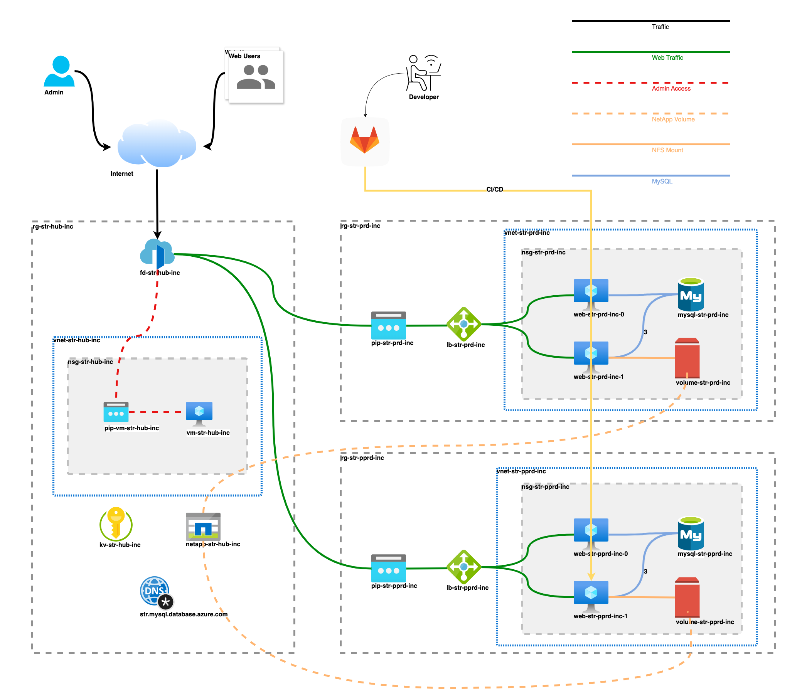
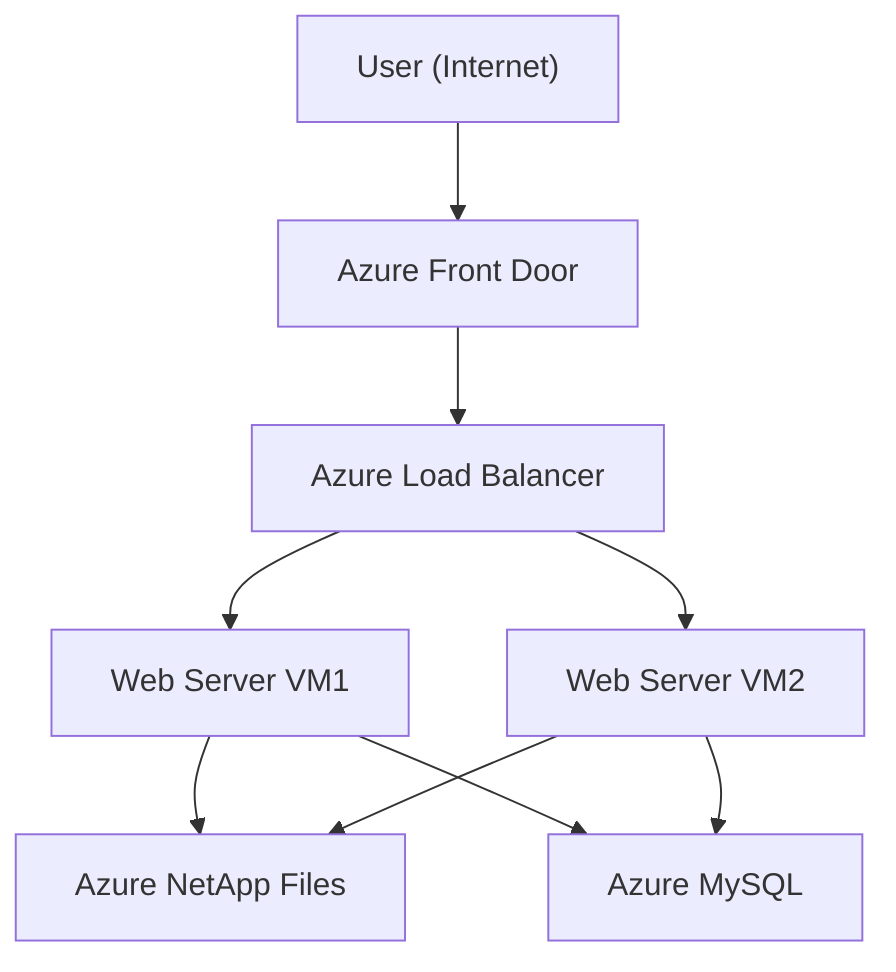

# Part 1: Shared Hosting Platform Architecture

## 📘 Introduction

This section introduces the Azure infrastructure powering the shared hosting platform. The solution is designed to host multi-tenant PHP applications (e.g., WordPress) on a scalable, secure, and high-performance LAMP stack.

---

## 🧱 Topics Covered

1. [Architecture Overview](#architecture-overview)
2. [Resource Considerations](#resource-considerations)
3. [Connection Flow](#connection-flow)

---

## 🏗️ Architecture Overview

The platform follows a **Hub-and-Spoke Network Topology**, promoting modularity, isolation, and centralized control.

### 🔹 Hub Network

Shared services accessible across environments:

- **Azure Bastion** – Secure SSH access to VMs
- **Azure Front Door** – Global traffic routing, SSL termination, Web Application Firewall (WAF)
- **Azure NetApp Files** – Centralized high-speed storage for web content
- **Azure Key Vault** – Centralized secrets and certificate management

### 🔸 Spoke Networks

Isolated VNets tailored to specific environments:

- **Production** – Hosts live websites
- **Preproduction** – Used for staging, testing, and QA

> 🛡️ **Why Hub-and-Spoke?**
>
> - Strong environment isolation
> - Centralized security and logging
> - Simplified network expansion
> - Shared services reduce duplication and cost

---

## 🔧 Resource Considerations

### 🔐 Traffic & Security

- **Azure Front Door** – Entry point for users, handles SSL/TLS and WAF policies
- **Azure Load Balancer** – Distributes traffic across web servers for high availability
- **Network Security Groups (NSGs)** – Restrict traffic to HTTP/HTTPS; all other access is tightly controlled

### 🖥️ Compute & Storage

- **Ubuntu 24.04 VMs** – Run Apache with PHP support
- **Azure NetApp Files** – Shared NFS storage accessible by all web servers
- **Azure Database for MySQL** – Managed MySQL with automated backups and scaling support

### 🔑 Secrets Management

- **Azure Key Vault** – Stores sensitive data like DB passwords and TLS certificates, with integration to Front Door and VMs

### 🔒 Network Isolation

All backend resources (VMs, DB, storage) are in private subnets. Only Azure Front Door is publicly accessible, enhancing security posture.

---

## 🔁 Connection Flow

1. Users access websites over HTTPS.
2. Azure Front Door routes requests based on domain or path rules.
3. Traffic is passed to the Azure Load Balancer.
4. Load Balancer distributes it to the backend VM pool.
5. Apache web servers read/write content from Azure NetApp Files.
6. Web apps communicate with the Azure Database for MySQL.

---

🔜 **Next:** [Part 2 – Deploying Infrastructure with Terraform](../terraform/README.md)
