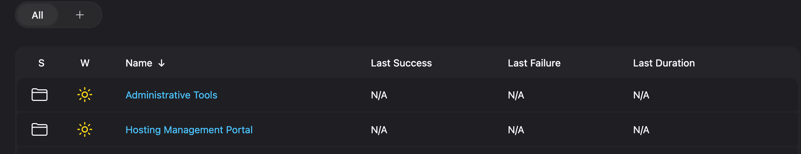
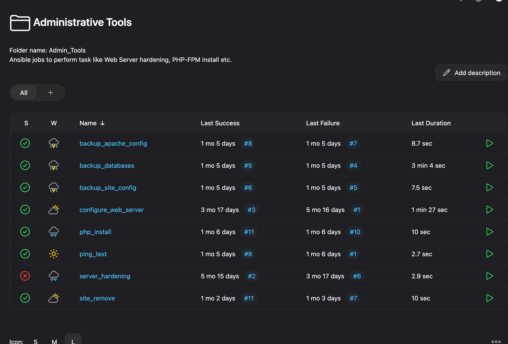
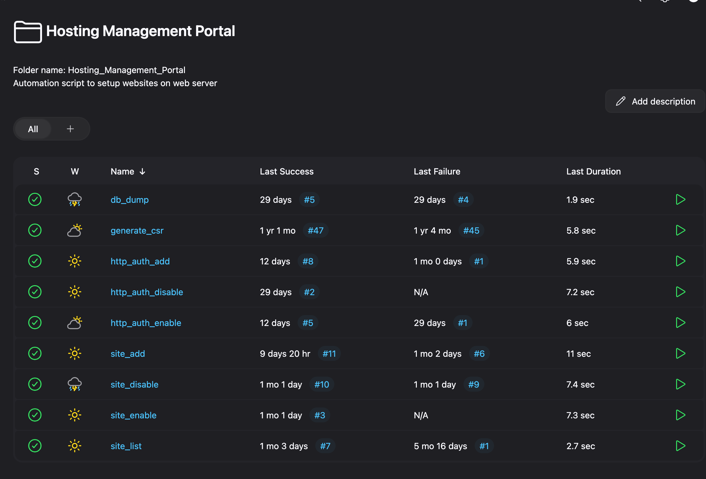

# Part 3: Jenkins-Ansible Automation for Webhost Platform

## 📘 Introduction

In this section, we integrate **Ansible** automation with **Jenkins** to build a self-service platform for managing web infrastructure—covering tasks like provisioning, site management, and backups.
This approach gives DevOps teams and site operators a user-friendly Jenkins interface, while Ansible does the heavy lifting in the background.

---

## 🔧 Key Capabilities

- Provision Apache, PHP-FPM, and MySQL servers
- Deploy HTML/PHP sites
- Enable/disable HTTP authentication
- Manage NetApp mounts and backups
- Build semi-automated infrastructure via Jenkins Freestyle Jobs

---

## 🧱 Prerequisites

Ensure the following are ready before starting:

- Bastion host deployed via [Part 2](../terraform/README.md#-sample-output)
- Jenkins and Docker configured
- Ansible and SSH key setup completed
- Backup volume mounted at `/backup`
- NetApp volume mounted at `/netappwebsites`

---

## 📦 Jenkins-Ansible Image Build

Before we configure Jenkins, build and push your Jenkins-Ansible Docker image:

```bash
cd jenkins-ansible
docker build --platform=linux/amd64 -t <your-repo>:<tag> .
docker push <your-repo>:<tag>
```

---

## ☁️ Bastion Host Preparation

1. **Install Docker** on Bastion:

```bash
cd terraform
ssh -i webadmin_rsa webadmin@<Bastion_VM_Public_IP>
curl -fsSL https://test.docker.com -o test-docker.sh
sudo sh test-docker.sh
sudo usermod -aG docker webadmin
```

Log out & login

2. **Mount Backup Storage** at `/backup`
   Follow [this Azure guide](https://learn.microsoft.com/en-gb/azure/storage/files/storage-files-how-to-mount-nfs-shares?tabs=Ubuntu#mount-an-nfs-share-using-the-azure-portal-recommended).
   Replace `/media/backup` with `/backup` in the script.

3. **Prepare Backup Directory Structure**

```bash
sudo mkdir -p /backup/webhost/{preproduction,production}/{apache_conf_backup,database_backup,site_config_backup}
```

4. **Verify User Access**

Ensure `webadmin` exists on all servers with passwordless `sudo`.

> **Note:** This is automatically handled during Terraform provisioning.

5. **Mount data disk at `/data`**

```bash
wget https://raw.githubusercontent.com/chinmaymjog/azure-lamp-hosting/main/scripts/datadisk_lvm.sh
chmod +x datadisk_lvm.sh
./datadisk_lvm.sh
```

---

## 🚀 Jenkins Setup on Bastion

1. **Clone & Launch Jenkins Container**

```bash
cd /data
sudo git clone https://github.com/chinmaymjog/azure-lamp-hosting .
cd /data/jenkins-ansible
sudo mkdir jenkins-home site-data
sudo chmod 777 jenkins-home
docker network create shared
docker compose up -d
```

2. **Access Jenkins UI**
   Visit: `http://<Bastion_VM_Public_IP>:8081`

3. **Retrieve Initial Admin Password**

```bash
docker exec jenkins-ansible cat /var/lib/jenkins/secrets/initialAdminPassword
```

4. **Install Required Plugins**

- Active Choices Plug-in
- Environment Injector
- ThinBackup

---

### 5. **Ansible Playbook Database Variables**

Create the file `/data/jenkins-ansible/playbooks/database_vars.yml` from the template `database_vars-template.yml`:

```bash
docker exec -it jenkins-ansible ansible-vault create /data/jenkins-ansible/playbooks/database_vars.yml
docker exec -it jenkins-ansible bash -c 'echo "<PASSWORD>" > /etc/ansible/vault.txt'
```

- This file stores the **database credentials** used by Ansible playbooks to interact with the database.
- Make sure to save the vault password in `/etc/ansible/vault.txt`. This allows Ansible to decrypt and use the credentials automatically when running playbooks. e.g. [here](./docs/jenkinas-jobs-playbooks.md#backup_databases).

---

## 🖥️ Web Host Preparation

### 🔗 Mount NetApp Volume

Follow the official Microsoft guide to mount an Azure NetApp Files NFS volume:

📘 **Recommended Steps:**
[Mount an NFS share using the Azure portal (Ubuntu)](https://learn.microsoft.com/en-gb/azure/storage/files/storage-files-how-to-mount-nfs-shares?tabs=Ubuntu#mount-an-nfs-share-using-the-azure-portal-recommended)

This includes:

1. Installing NFS client tools on your Ubuntu VM
2. Creating a mount point (e.g., `/netappwebsites`)
3. Using the appropriate `mount` command or adding an entry to `/etc/fstab`

Example:
SSH into your web VMs from the Bastion host:

```bash
ssh 10.0.2.4
sudo apt-get install nfs-common
```

Mount NetApp volume:

```bash
sudo mkdir -p /netappwebsites
sudo mount -t nfs -o rw,hard,rsize=262144,wsize=262144,sec=sys,vers=4.1,tcp 10.0.2.132:/host-pprd-inc /netappwebsites
```

Add to `/etc/fstab`:

```bash
echo "10.0.2.132:/host-pprd-inc /netappwebsites nfs rw,hard,rsize=262144,wsize=262144,sec=sys,vers=4.1,tcp 0 0" | sudo tee -a /etc/fstab
sudo systemctl daemon-reload
sudo mount -a
df -h
```

Repeat for all preprod/prod web VMs.

---

## 🛠 Jenkins Job Configuration

> **Note:** While adding jobs in Jenkins refer [jenkinas-jobs-playbooks.md](./docs/jenkinas-jobs-playbooks.md) to add jobs.

### 🔧 Create a Freestyle Project

This is a simple example of how to create and configure a Jenkins job via the UI.

#### 1. **Create a New Job**

- Go to **New Item**
- Select **Freestyle project**
- Name your job appropriately

#### 2. **Add Parameters**

- Enable **"This project is parameterized"**
- Add an **Active Choices Parameter**:

  - **Name**: `web_environment`
  - **Groovy Script**:

    ```groovy
    return ['preproduction', 'production']
    ```

📸 _Example:_


#### 3. **Add Build Step**

- Under **Build**, choose **Execute shell**
- Add the following Ansible command:

```bash
sudo ansible-playbook --extra-vars "web_environment=${web_environment}" /etc/ansible/playbooks/ping.yml
```

#### 4. **Configure Post-Build Actions**

- Enable **Email Notification** (if required)

📸 _Examples:_


#### 5. **Run the Job**

- Click **Build with Parameters**
- Select an environment from the dropdown
- Click **Build** to trigger the pipeline

---

🗂 **Organize Your Jobs**

For better structure, create the following folders in Jenkins:

- `Administrative Tools`
- `Hosting Management Portal`

Refer to [jenkinas-jobs-playbooks.md](./docs/jenkinas-jobs-playbooks.md) for details on setting up individual playbooks and job configurations.

---

## 📘 Ansible Playbooks Reference

## Here's a catalog of available playbooks and their Jenkins integration:

| Playbook                                                                         | Usage                                                                                  |
| -------------------------------------------------------------------------------- | -------------------------------------------------------------------------------------- |
| [server_hardening.yml](./ansible/playbooks/server_hardening.yml)                 | [server_hardening](./docs/jenkinas-jobs-playbooks.md#server_hardening)                 |
| [server_web_configuration.yml](./ansible/playbooks/server_web_configuration.yml) | [server_web_configuration](./docs/jenkinas-jobs-playbooks.md#server_web_configuration) |
| [php_install.yml](./ansible/playbooks/php_install.yml)                           | [php_install](./docs/jenkinas-jobs-playbooks.md#php_install)                           |
| [php_site_add.yml](./ansible/playbooks/php_site_add.yml)                         | [site_add](./docs/jenkinas-jobs-playbooks.md#site_add)                                 |
| [php_site_enable.yml](./ansible/playbooks/php_site_enable.yml)                   | [site_enable](./docs/jenkinas-jobs-playbooks.md#site_enable)                           |
| [php_site_disable.yml](./ansible/playbooks/php_site_disable.yml)                 | [site_disable](./docs/jenkinas-jobs-playbooks.md#site_disable)                         |
| [php_site_remove.yml](./ansible/playbooks/php_site_remove.yml)                   | [site_remove](./docs/jenkinas-jobs-playbooks.md#site_remove)                           |
| [html_site_add.yml](./ansible/playbooks/html_site_add.yml)                       | [site_add](./docs/jenkinas-jobs-playbooks.md#site_add)                                 |
| [html_site_enable.yml](./ansible/playbooks/html_site_enable.yml)                 | [site_enable](./docs/jenkinas-jobs-playbooks.md#site_enable)                           |
| [html_site_disable.yml](./ansible/playbooks/html_site_disable.yml)               | [site_disable](./docs/jenkinas-jobs-playbooks.md#site_disable)                         |
| [html_site_remove.yml](./ansible/playbooks/html_site_remove.yml)                 | [site_remove](./docs/jenkinas-jobs-playbooks.md#site_remove)                           |
| [http_auth_add.yml](./ansible/playbooks/http_auth_add.yml)                       | [http_auth_add](./docs/jenkinas-jobs-playbooks.md#http_auth_add)                       |
| [http_auth_enable.yml](./ansible/playbooks/http_auth_enable.yml)                 | [http_auth_enable](./docs/jenkinas-jobs-playbooks.md#http_auth_enable)                 |
| [http_auth_disable.yml](./ansible/playbooks/http_auth_disable.yml)               | [http_auth_disable](./docs/jenkinas-jobs-playbooks.md#http_auth_disable)               |
| [site_list.yml](./ansible/playbooks/site_list.yml)                               | [site_list](./docs/jenkinas-jobs-playbooks.md#site_list)                               |
| [backup_apache_config.yml](./ansible/playbooks/backup_apache_config.yml)         | [backup_apache_config](./docs/jenkinas-jobs-playbooks.md#backup_apache_config)         |
| [backup_site_config.yml](./ansible/playbooks/backup_site_config.yml)             | [backup_site_config](./docs/jenkinas-jobs-playbooks.md#backup_site_config)             |
| [backup_databases.yml](./ansible/playbooks/backup_databases.yml)                 | [backup_databases](./docs/jenkinas-jobs-playbooks.md#backup_databases)                 |
| [db_dump.yml](./ansible/playbooks/db_dump.yml)                                   | [db_dump](./docs/jenkinas-jobs-playbooks.md#db_dump)                                   |
| [generate_csr.yml](./ansible/playbooks/generate_csr.yml)                         | [generate_csr](./docs/jenkinas-jobs-playbooks.md#generate_csr)                         |
| [generate_pfx.yml](./ansible/playbooks/generate_pfx.yml)                         | [generate_pfx](./docs/jenkinas-jobs-playbooks.md#generate_pfx)                         |
| [ping.yml](./ansible/playbooks/ping.yml)                                         | [ping](./docs/jenkinas-jobs-playbooks.md#ping)                                         |

---

Once you followed & setup all jobs, you will have jenkins jobs structure like this:





---

## ✅ Conclusion

You've now built a powerful semi-automated infrastructure platform using Jenkins and Ansible. Through the Jenkins UI, teams can manage and deploy sites, perform backups, and execute common tasks securely and consistently—without needing direct server access.
