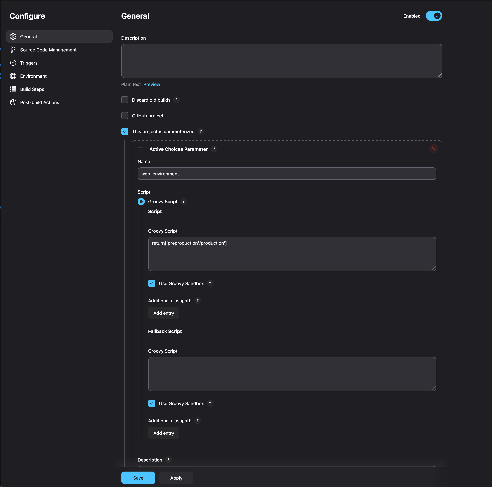
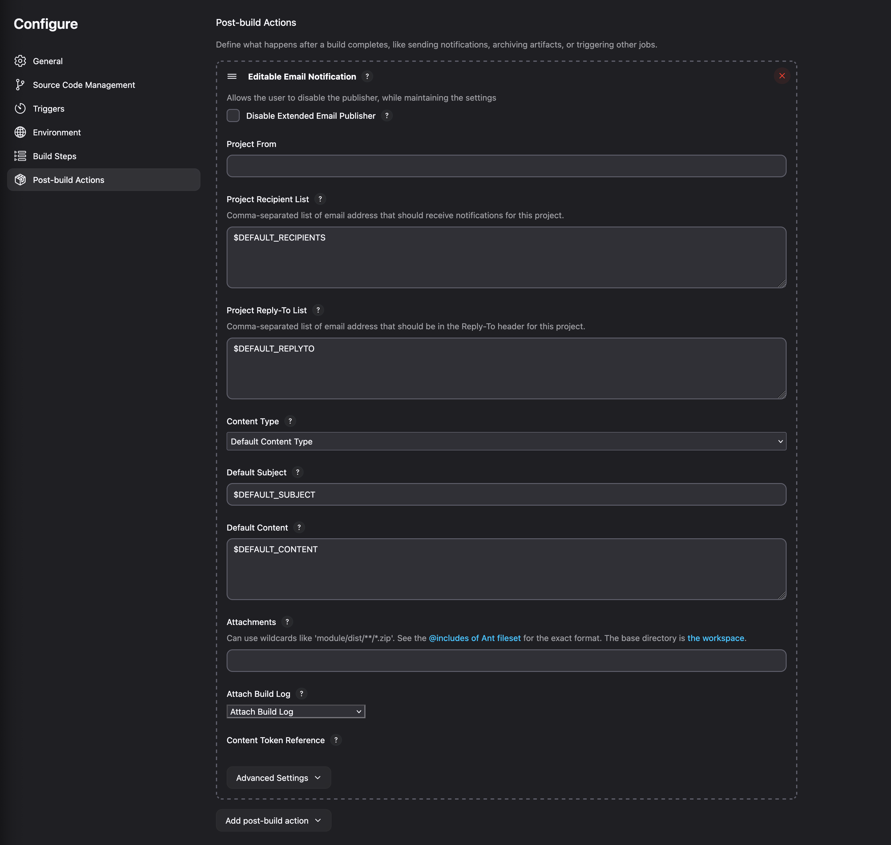
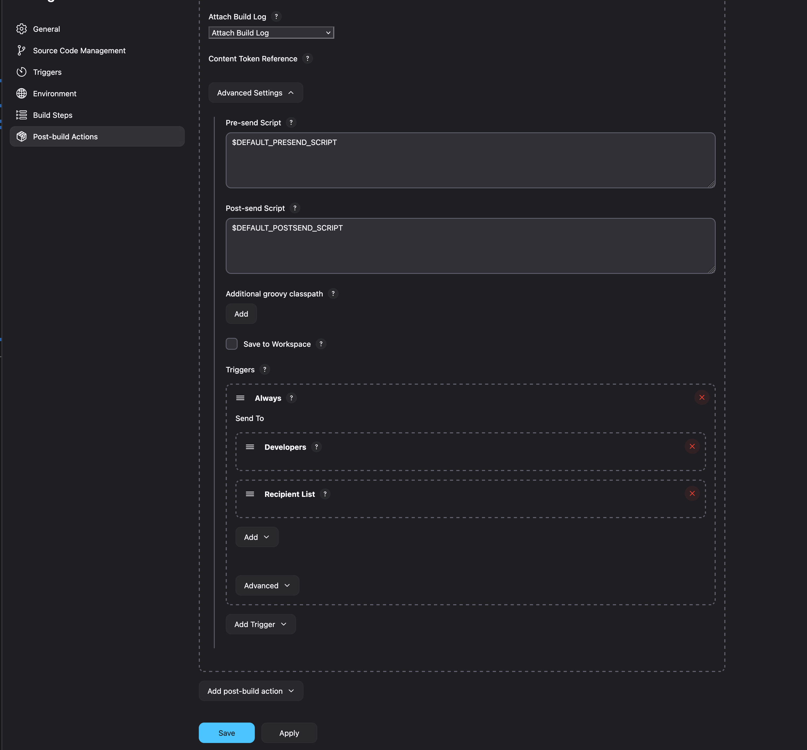
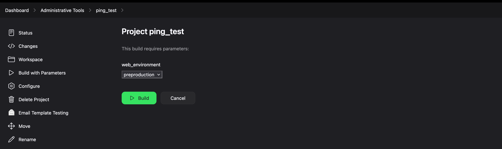

# Jenkins-Ansible

This repository contains a collection of Ansible playbooks designed to manage various aspects of Apache web server environments, PHP-FPM, MySQL databases, and site configurations. These playbooks are executed through Jenkins Freestyle Projects, which provide a UI-driven interface to DevOps engineers or operators.

Each Jenkins job is enhanced with Active Choices parameters, allowing dynamic, context-aware inputs such as environment selection, site type, PHP version, and more. These parameters are configured using Groovy scripts for flexibility and control.

The goal is to offer a semi-automated, self-service platform for infrastructure tasks like deploying sites, backing up configs, enabling/disabling HTTP auth, and performing database operations—all through a simple Jenkins interface powered by Ansible under the hood.

---

## Table of Contents

- [Installation](#installation)
- [Jenkins Configuration](#jenkins-configuration)
- [Playbooks](#playbooks)

## Installation

### Prerequisites

- **Docker:** Ensure Docker is installed on the control node.
- **Backup Storage:** The NFS or Azure Files mount must be available at `/backup`.
- **SSH Access:** The Ansible control node must access target servers via SSH:
  - Private key: `~/.ssh/id_rsa`
  - The corresponding public key should be in each server's `~webadmin/.ssh/authorized_keys`
- **User Access:** The `webadmin` user must exist on all servers and have passwordless sudo privileges.
- **Backup Directory Structure:** Create the required directories on your backup server:

  ```bash
  mkdir -p /backup/webhost/preproduction/apache_conf_backup
  mkdir -p /backup/webhost/preproduction/database_backup
  mkdir -p /backup/webhost/preproduction/site_config_backup

  mkdir -p /backup/webhost/production/apache_conf_backup
  mkdir -p /backup/webhost/production/database_backup
  mkdir -p /backup/webhost/production/site_config_backup
  ```

### Jenkins Setup

1. **Clone the Repository and Start Jenkins:**
   ```bash
   cd /data/new-jenkins-ansible
   mkdir jenkins-home site-data
   git clone https://github.com/yourname/your-repository.git .
   chmod 777 jenkins-home
   docker compose up -d
   ```
2. **Access Jenkins:**  
   Visit [http://<SERVER_IP>:8082](http://<SERVER_IP>:8082) after starting the container.

3. **Retrieve the Initial Admin Password:**
   ```bash
   docker exec new-jenkins cat /var/lib/jenkins/initialAdminPassword
   ```
4. **Complete Initial Setup:**  
   Follow the setup wizard and install the following plugins:
   - Active Choices Plug-in
   - Environment Injector
   - ThinBackup

## Jenkins Configuration

The Jenkins UI provides an interactive interface for running Ansible playbooks by letting you choose parameters.

### Example: Creating a Freestyle Project

1. **New Item Creation:**
   - From the **Administrative Tools** folder, click **New Item**.
   - Enter a name (e.g., `ping_test_example`) and select **Freestyle project**.
2. **Project Configuration:**
   - Add a project description.
   - Enable **This project is parameterized**.
   - Add an **Active Choices Parameter** with:
     - **Parameter Name:** `web_environment`
     - **Groovy Script:** `return ['preproduction','production']`
   - 
3. **Build Step:**
   - Under **Build Steps**, select **Execute shell**.
   - Enter the command:
     ```bash
     sudo ansible-playbook --extra-vars "web_environment=${web_environment}" /etc/ansible/playbooks/ping.yml
     ```
4. **Post-build Actions:**
   - Add **Editable Email Notification**.
   - In the advanced settings, change the trigger from default to **Always**.
   - 
   - 
5. **Running the Job:**
   - From **Administrative Tools**, choose **Build with Parameters**.
   - Select an environment (e.g., `preproduction`) and click **Build**.
   - Check the console output via the green build button.
   - 

The job will execute a command similar to:

```bash
sudo ansible-playbook --extra-vars "web_environment=preproduction" /etc/ansible/playbooks/ping.yml
```

## Playbooks

Below is a list of available playbooks and their corresponding Jenkins jobs, along with key configuration details like parameter types, Groovy scripts, and a brief description of each job.

| Playbook                                                                         | Usage                                                                    |
| -------------------------------------------------------------------------------- | ------------------------------------------------------------------------ |
| [server_hardening.yml](./ansible/playbooks/server_hardening.yml)                 | [server_hardening](./docs/playbooks.md#server_hardening)                 |
| [server_web_configuration.yml](./ansible/playbooks/server_web_configuration.yml) | [server_web_configuration](./docs/playbooks.md#server_web_configuration) |
| [php_install.yml](./ansible/playbooks/php_install.yml)                           | [php_install](./docs/playbooks.md#php_install)                           |
| [php_site_add.yml](./ansible/playbooks/php_site_add.yml)                         | [site_add](./docs/playbooks.md#site_add)                                 |
| [php_site_enable.yml](./ansible/playbooks/php_site_enable.yml)                   | [site_enable](./docs/playbooks.md#site_enable)                           |
| [php_site_disable.yml](./ansible/playbooks/php_site_disable.yml)                 | [site_disable](./docs/playbooks.md#site_disable)                         |
| [php_site_remove.yml](./ansible/playbooks/php_site_remove.yml)                   | [site_remove](./docs/playbooks.md#site_remove)                           |
| [html_site_add.yml](./ansible/playbooks/html_site_add.yml)                       | [site_add](./docs/playbooks.md#site_add)                                 |
| [html_site_enable.yml](./ansible/playbooks/html_site_enable.yml)                 | [site_enable](./docs/playbooks.md#site_enable)                           |
| [html_site_disable.yml](./ansible/playbooks/html_site_disable.yml)               | [site_disable](./docs/playbooks.md#site_disable)                         |
| [html_site_remove.yml](./ansible/playbooks/html_site_remove.yml)                 | [site_remove](./docs/playbooks.md#site_remove)                           |
| [http_auth_add.yml](./ansible/playbooks/http_auth_add.yml)                       | [http_auth_add](./docs/playbooks.md#http_auth_add)                       |
| [http_auth_enable.yml](./ansible/playbooks/http_auth_enable.yml)                 | [http_auth_enable](./docs/playbooks.md#http_auth_enable)                 |
| [http_auth_disable.yml](./ansible/playbooks/http_auth_disable.yml)               | [http_auth_disable](./docs/playbooks.md#http_auth_disable)               |
| [site_list.yml](./ansible/playbooks/site_list.yml)                               | [site_list](./docs/playbooks.md#site_list)                               |
| [backup_apache_config.yml](./ansible/playbooks/backup_apache_config.yml)         | [backup_apache_config](./docs/playbooks.md#backup_apache_config)         |
| [backup_site_config.yml](./ansible/playbooks/backup_site_config.yml)             | [backup_site_config](./docs/playbooks.md#backup_site_config)             |
| [backup_databases.yml](./ansible/playbooks/backup_databases.yml)                 | [backup_databases](./docs/playbooks.md#backup_databases)                 |
| [db_dump.yml](./ansible/playbooks/db_dump.yml)                                   | [db_dump](./docs/playbooks.md#db_dump)                                   |
| [generate_csr.yml](./ansible/playbooks/generate_csr.yml)                         | [generate_csr](./docs/playbooks.md#generate_csr)                         |
| [generate_pfx.yml](./ansible/playbooks/generate_pfx.yml)                         | [generate_pfx](./docs/playbooks.md#generate_pfx)                         |
| [ping.yml](./ansible/playbooks/ping.yml)                                         | [ping](./docs/playbooks.md#ping)                                         |
