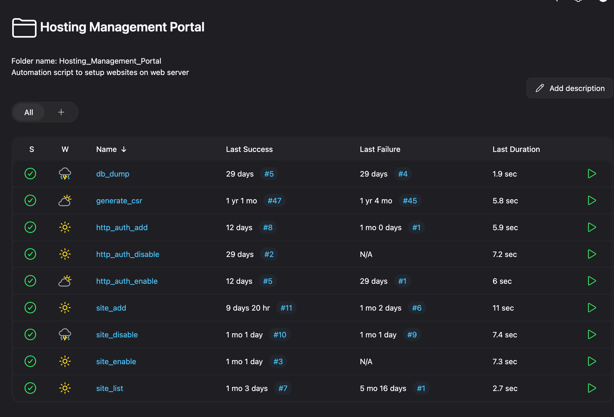

# Part 4: Automating with Jenkins & Ansible

Once Jenkins and Ansible are set up, the next step is to define what jobs and playbooks will deliver. To keep things simple and structured, we organize jobs into two categories:

- **Administrative Tools** → System-level operations like backups, server hardening, and configuration.
- **Hosting Management Portal** → Application & website lifecycle management (add, remove, enable, disable, etc.).

For better readability, create the following folders inside Jenkins:

- `Administrative Tools`
- `Hosting Management Portal`

Once you followed & setup all jobs, you will have jenkins jobs structure like this:

---

## Recommended Flow

To ensure a smooth setup, run jobs in the following sequence:

1. **server_hardening** → Secure the base OS with CIS benchmark, SSH restrictions, firewall rules, etc.
2. **configure_web_server** → Apply Apache configuration (virtual hosts, authentication, PHP-FPM integration).
3. **php_install** → Install and configure PHP with required extensions for your environment.

This flow ensures your server is hardened, the web layer is properly configured, and PHP is ready for hosting applications.

---

## Job Categories

### 🔹 Administrative Tools

These jobs focus on infrastructure and security management:

- **backup_apache_config** → Backup Apache & PHP-FPM configs with timestamps.
- **backup_databases** → Secure MySQL backups for recovery and audits.
- **backup_site_config** → Save site-level configs like `.env`, `wp-config.php`, `.htaccess`.
- **server_hardening** → Apply OS-level security best practices.
- **configure_web_server** → Configure Apache, authentication, and PHP-FPM integration.
- **php_install** → Install PHP and required modules.
- **site_remove** → Safely remove site configurations.

### 🔹 Hosting Management Portal

These jobs manage the hosting lifecycle of websites and databases:

- **site_add / site_remove** → Add or remove sites (HTML or PHP).
- **site_enable / site_disable** → Enable or disable sites via Apache configs.
- **site_list** → View available and active websites.
- **db_dump** → Dump databases for migration or troubleshooting.
- **http_auth_add / enable / disable** → Manage HTTP authentication for secure access.
- **generate_csr** → Generate SSL CSRs for HTTPS setup.
