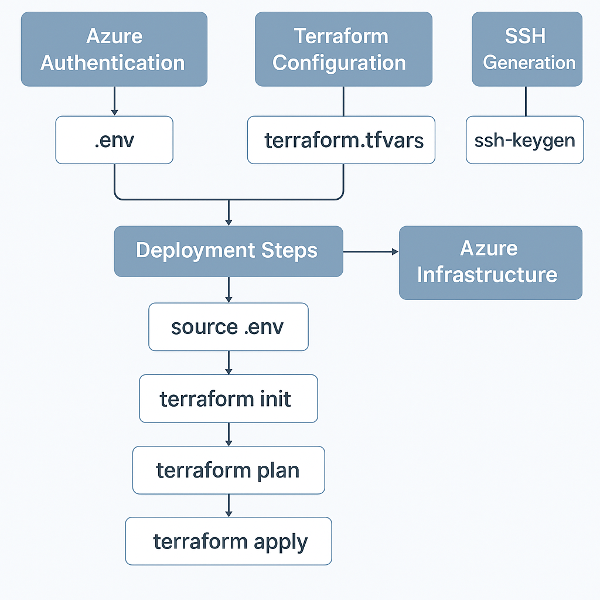

# Part 2: Terraform – Deploying Azure Infrastructure

## 📘 Introduction

In this section, we automate the provisioning of the shared hosting platform’s Azure infrastructure using **Terraform**. The setup emphasizes modularity, scalability, security, and zone-aware deployment strategies.



---

## 🧱 Prerequisites

1. An active [Azure account](https://azure.microsoft.com/en-us/free/)
2. A [**Service Principal**](https://learn.microsoft.com/en-us/cli/azure/create-an-azure-service-principal-azure-cli) with the **Contributor** role assigned to your [Azure subscription](https://learn.microsoft.com/en-us/azure/role-based-access-control/role-assignments-portal)

---

## 📁 Project Structure

```bash
terraform/
├── modules/
│   ├── hub/              # Shared components
│   └── web/              # Environment-specific components
├── .env                  # Azure credentials (not committed)
├── main.tf
├── outputs.tf
├── providers.tf
├── terraform.tfvars      # Variable values
├── variables.tf          # Variable definitions
├── webadmin_rsa          # Private SSH key
└── webadmin_rsa.pub      # Public SSH key
```

---

## 🔐 Azure Authentication

Set your Azure credentials in the `.env` file:

```env
export ARM_CLIENT_ID="00000000-0000-0000-0000-000000000000"
export ARM_CLIENT_SECRET="xxxxxxxxxxxxxxxxxxxxxxxxxxxxxxxx"
export ARM_TENANT_ID="10000000-0000-0000-0000-000000000000"
export ARM_SUBSCRIPTION_ID="20000000-0000-0000-0000-000000000000"
```

Then load the environment:

```bash
source .env
```

> ⚠️ **Important:** Never commit `.env` to version control.

---

## ⚙️ Configure `terraform.tfvars`

Customize your infrastructure by editing the `terraform.tfvars` file. Sample values:

```hcl
project             = "webhost"
p_short             = "host"
location            = "centralindia"
l_short             = "inc"
preferred_zone      = "1"
vm_user             = "webadmin"
ip_allow            = ["152.58.XX.XX", "X.X.X.X"]

hub_vnet_space        = ["10.0.0.0/24"]
hub_snet_web          = ["10.0.0.0/26"]
bastion_size          = "Standard_B2s"
bastion_osdisk        = 64
bastion_datadisk      = 64
netapp_sku            = "Standard"
netapp_pool_size_intb = 1
file_share_quota      = 100

webvm_size            = "Standard_B2s"
webvm_count           = 2
webvm_osdisk          = 64
webvm_datadisk        = 64
dbsku                 = "GP_Standard_D2ads_v5"
dbsize                = 20
netapp_volume_sku     = "Standard"
storage_quota_in_gb   = 100

preprod_vnet_space    = ["10.0.2.0/24"]
preprod_snet_web      = ["10.0.2.0/26"]
preprod_snet_db       = ["10.0.2.64/26"]
preprod_snet_netapp   = ["10.0.2.128/26"]

prod_vnet_space       = ["10.0.1.0/24"]
prod_snet_web         = ["10.0.1.0/26"]
prod_snet_db          = ["10.0.1.64/26"]
prod_snet_netapp      = ["10.0.1.128/26"]
```

> 💡 **Zone Awareness**
> Ensure that your VMs and NetApp volumes are deployed in the **same Availability Zone** to avoid throughput or latency issues.

---

## 🔑 SSH Access – Key Pair

Generate an SSH key pair for VM access:

```bash
ssh-keygen -t rsa -f webadmin_rsa
```

The `webadmin_rsa.pub` file will be injected into VMs during provisioning.

---

## 🚀 Terraform Deployment Steps

```bash
cd terraform

# Load credentials
source .env

# Initialize Terraform
terraform init

# Review execution plan
terraform plan

# Apply infrastructure
terraform apply
```

---

## ✅ Sample Output

Once complete, Terraform will display key outputs:

```
Hub Resource Group Name = rg-host-hub-inc
Front Door Name = fd-host-hub-inc
Netapp Account Name = netapp-host-hub-inc
Netapp Pool Name = pool-host-hub-inc
DNS Zone Name = host.mysql.database.azure.com
Key Vault Name = kv-host-hub-inc
Container Registry Login Server = acrhosthubinc.azurecr.io
Container Registry Admin Username = acrhosthubinc

Bastion VM Public IP = 135.235.XX.0
Bastion VM Private IP = 10.0.0.4

Production Resource Group Name = rg-host-prd-inc
Production MySQL server Name = mysql-host-prd-inc
Production Load Balancer IP = 135.235.XX.22
  Production Web Server Private IPs
  web-host-prd-inc-0 = 10.0.1.5
  web-host-prd-inc-1 = 10.0.1.4

PreProduction Resource Group Name = rg-host-pprd-inc
PreProduction MySQL server Name = mysql-host-pprd-inc
PreProduction Load Balancer IP = 52.172.195.226
  PreProduction Web Server Private IPs
  web-host-pprd-inc-0 = 10.0.2.4
  web-host-pprd-inc-1 = 10.0.2.5
```

> 📁 A `hosts` file will also be generated—used as your **Ansible inventory** in Part 3.

---

## 🔧 Terraform Modules Overview

### `module "hub"` – Shared Core Resources

- Azure Front Door
- Hub VNet & Subnets
- Bastion VM with disks and IPs
- Azure NetApp Account, Pool, and Share
- Key Vault & DNS Zone
- Azure Container Registry (ACR)

### `module "web"` – Per-Environment Resources (Prod & Preprod)

- VNet and subnets for Web, DB, and NetApp
- Web Server VMs with disks and NSGs
- Load Balancer
- Azure Database for MySQL (Flexible Server)
- NetApp Volumes (one per environment)
- Peering with Hub Network

All per-environment modules consume outputs from the `hub` module for seamless integration.

---

🔜 **Next:** [Part 3: Jenkins-Ansible Automation for Webhost Platform](../jenkins-ansible/README.md)
