```mermaid
flowchart TD
    %% Resource Groups
    subgraph rg-host-prd-inc [RG: rg-host-prd-inc]
        VNetprd["VNet: vnet-host-prd-inc"]
        NSGprd["Network Security Group: nsg-host-prd-inc"]
        PIPprd["Public IP: pip-host-prd-inc"]
        LB_prd["Load Balancer: lb-host-prd-inc"]
        NICVM0_prd["NIC: nic-host-prd-inc-0"]
        VM0_prd["VM: web-host-prd-inc-0"]
        OSDiskVM0_prd["OS Disk: osdiskwebhostprdinc0"]
        DataDiskVM0_prd["Data Disk: diskwebhostprdinc0"]
        NICVM1_prd["NIC: nic-host-prd-inc-1"]
        VM1_prd["VM: web-host-prd-inc-1"]
        OSDiskVM1_prd["OS Disk: osdiskwebhostprdinc1"]
        DataDiskVM1_prd["Data Disk: diskwebhostprdinc1"]
        MySQLprd["MySQL: mysql-host-prd-inc"]
    end

    subgraph rg-host-hub-inc [RG: rg-host-hub-inc]
        VNetHub["VNet: vnet-host-hub-inc"]
        NSGHub["NSG: nsg-host-hub-inc"]
        PIPVMHub["PIP: pip-vm-host-hub-inc"]
        NICVMHub["NIC: nic-vm-host-hub-inc"]
        VMHub["VM: vm-host-hub-inc"]
        OSDiskVMHub["OS Disk: osdiskvmhosthubinc"]
        DataDiskVMHub["Data Disk: diskvmhosthubinc"]
        FD["Front Door: fd-host-hub-inc"]
        PrivateDNSzone["Private DNS: host.mysql.database.azure.com"]
        KV["Key Vault: kv-host-hub-inc"]
        NetApp["NetApp: netapp-host-hub-inc"]
        NetAppPool["Pool: pool-host-hub-inc"]
        NICVolumepprd["NIC: anf-vnet-host-pprd-inc-nic"]
        Volumepprd["Volume: volume-host-pprd-inc"]
        NICVolumeprd["NIC: anf-vnet-host-prd-inc-nic"]
        Volumeprd["Volume: volume-host-prd-inc"]
    end

    subgraph rg-host-pprd-inc [RG: rg-host-pprd-inc]
        VNetpprd["VNet: vnet-host-pprd-inc"]
        NSGpprd["NSG: nsg-host-pprd-inc"]
        PIPpprd["PIP: pip-host-pprd-inc"]
        LB_pprd["Load Balancer: lb-host-pprd-inc"]
        NICVM0_pprd["NIC: nic-host-pprd-inc-0"]
        VM0_pprd["VM: web-host-pprd-inc-0"]
        OSDiskVM0_pprd["OS Disk: osdiskwebhostpprdinc0"]
        DataDiskVM0_pprd["Data Disk: diskwebhostpprdinc0"]
        NICVM1_pprd["NIC: nic-host-pprd-inc-1"]
        VM1_pprd["VM: web-host-pprd-inc-1"]
        OSDiskVM1_pprd["OS Disk: osdiskwebhostpprdinc1"]
        DataDiskVM1_pprd["Data Disk: diskwebhostpprdinc1"]
        MySQLpprd["MySQL: mysql-host-pprd-inc"]
    end

    %% Relationships - Hub
    VNetHub --> NICVMHub
    NSGHub --> NICVMHub
    PIPVMHub --> NICVMHub
    NICVMHub --> VMHub
    VMHub --> OSDiskVMHub
    VMHub --> DataDiskVMHub
    PrivateDNSzone --> MySQLpprd
    PrivateDNSzone --> MySQLprd
    NetApp --> NetAppPool
    NetAppPool --> Volumepprd
    NetAppPool --> Volumeprd
    NICVolumepprd --> Volumepprd
    NICVolumeprd --> Volumeprd

    %% Preprod
    FD --> PIPpprd
    PIPpprd --> LB_pprd
    LB_pprd --> NICVM0_pprd
    LB_pprd --> NICVM1_pprd
    NICVM0_pprd --> VM0_pprd
    NICVM1_pprd --> VM1_pprd
    VM0_pprd --> OSDiskVM0_pprd
    VM1_pprd --> OSDiskVM1_pprd
    VM0_pprd --> DataDiskVM0_pprd
    VM1_pprd --> DataDiskVM1_pprd
    VM0_pprd --> Volumepprd
    VM1_pprd --> Volumepprd
    VM0_pprd --> MySQLpprd
    VM1_pprd --> MySQLpprd
    NSGpprd --> NICVM0_pprd
    NSGpprd --> NICVM1_pprd
    VNetpprd --> NICVM0_pprd
    VNetpprd --> NICVM1_pprd

    %% Prod
    FD --> PIPprd
    PIPprd --> LB_prd
    LB_prd --> NICVM0_prd
    LB_prd --> NICVM1_prd
    NICVM0_prd --> VM0_prd
    NICVM1_prd --> VM1_prd
    VM0_prd --> OSDiskVM0_prd
    VM1_prd --> OSDiskVM1_prd
    VM0_prd --> DataDiskVM0_prd
    VM1_prd --> DataDiskVM1_prd
    VM0_prd --> Volumeprd
    VM1_prd --> Volumeprd
    VM0_prd --> MySQLprd
    VM1_prd --> MySQLprd
    NSGprd --> NICVM0_prd
    NSGprd --> NICVM1_prd
    VNetprd --> NICVM0_prd
    VNetprd --> NICVM1_prd
```

# Part 2: Terraform – Deploying Azure Infrastructure

## 📘 Introduction

This part focuses on using **Terraform** to provision a secure and scalable Azure infrastructure for the shared hosting platform. The setup is modular, zone-aware, and includes key automation practices.

---

## 📁 Project Structure

```

terraform/
├── modules/
│   |── hub/
│   └── web/
├── .env
├── main.tf
├── outputs.tf
|── providers.tf
|-- terraform.tfvars
|-- variables.tf
|-- webadmin_rsa
└-- webadmin_rsa.pub


```

- `hub/`: Deploys shared components (Front Door, Bastion, NetApp, Key Vault)
- `web/`: Deploys Preproduction and Production environments (VMs, MySQL, NetApp)

---

## 🔐 Azure Authentication

Set Azure credentials in `.env` file:

```env
ARM_CLIENT_ID=xxxxx
ARM_CLIENT_SECRET=xxxxx
ARM_SUBSCRIPTION_ID=xxxxx
ARM_TENANT_ID=xxxxx
```

Then run:

```bash
source .env
```

> 🔒 Never commit `.env` to GitHub

---

## ⚙️ Configure `terraform.tfvars`

Edit `terraform.tfvars` to suit your project. Sample values:

```hcl
project        = "webhost"
p_short        = "host"
location       = "centralindia"
l_short        = "inc"
preferred_zone = "1"
vm_user        = "webadmin"
ip_allow       = ["<your-public-ip>"]
```

> ⚠️ **Zone Awareness**
> Ensure your **VMs and NetApp volumes are in the same availability zone** to avoid latency, IOPS, or throughput issues.

---

## 🔑 Generate SSH Key

Create an SSH key pair for logging into VMs:

```bash
ssh-keygen -t rsa -f webadmin_rsa
```

Keep `webadmin_rsa.pub` ready to use in Terraform.

---

## 🚀 Deployment Steps

```bash
cd terraform

# Load credentials
source .env

# Initialize Terraform
terraform init

# Review plan
terraform plan

# Apply infrastructure
terraform apply
```

---

## ✅ Sample Output

```
Hub Resource Group Name         = rg-host-hub-inc
Front Door Name                 = fd-host-hub-inc
NetApp Account Name             = netapp-host-hub-inc
Key Vault Name                  = kv-host-hub-inc
Bastion VM Public IP            = 135.235.171.0
Bastion VM Private IP           = 10.0.0.4

Production Resource Group Name  = rg-host-prd-inc
Production Load Balancer IP     = 135.235.171.22
Production Web Server IPs:
  web-host-prd-inc-0            = 10.0.1.5
  web-host-prd-inc-1            = 10.0.1.4

Preproduction Resource Group    = rg-host-pprd-inc
Preproduction Load Balancer IP  = 52.172.195.226
Preproduction Web Server IPs:
  web-host-pprd-inc-0           = 10.0.2.4
  web-host-pprd-inc-1           = 10.0.2.5
```

---

## 🔧 Terraform Module Highlights

### `module "hub"` – Shared Resources

Creates:

- Azure Front Door
- Bastion Host VM
- Azure NetApp Files
- Key Vault
- DNS Zone

### `module "web"` – Per-Environment Resources (Prod & Preprod)

Creates:

- VNets and Subnets
- Apache Web VMs
- Azure Database for MySQL
- NetApp Volumes
- LB + NSGs + Peering with Hub

All environment modules receive outputs from the `hub` module for shared services.

---


